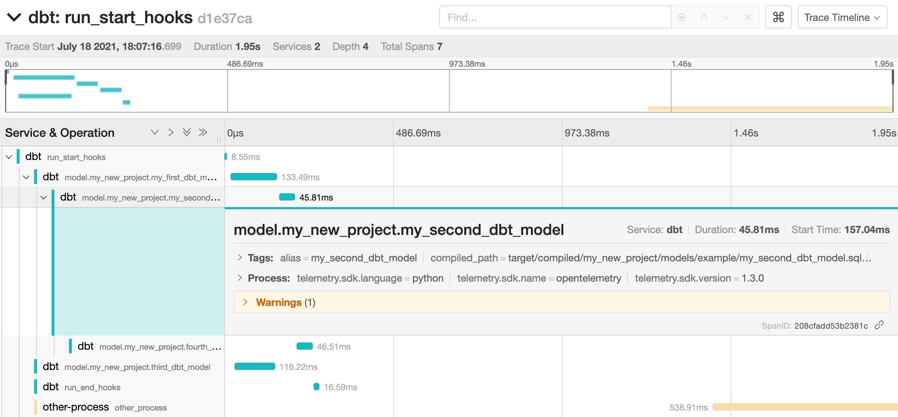

# dbt-opentelemetry

**WARNING**: This is a POC, do not depend on it in production, if it turned out to be useful it should be re-implemented in the core `dbt` project and not "monkey patched" into it.

This POC integrates [Open Telemetry](https://opentelemetry-python.readthedocs.io) and [dbt](https://www.getdbt.com/) to understand if/how distributed tracing could be applied to a full data pipeline and the potential benefits of doing so.

Can we re-use the concepts of tracing and distributed tracing to have better observability of our data pipelines? What are the challenges of applying concepts of Request tracing to Batch processes?

Here is a screenshot from running the demo:



## Alternative

There is another solution to audit dbt runs: [dbt-event-logging](https://github.com/dbt-labs/dbt-event-logging):

* It writes to the Data Warehouse, so the audit can slow down the runs (Data Warehouses are typically not tuned for many inserts of small sizes).
* It does not come with out of the box visualizations and alerting.
* It is specific to dbt, so if our pipeline workload is "distributed" across different systems like Airflow, dbt, Beam, internal services (like ML models), we need different strategies to see the "full picture" (sometimes called the "Main" DAG).

## POC

With the Open Telemetry API we can emit traces in all the components that make up our data pipeline, and plug-in "receivers" (tracing back-ends) to visualize and alert on these traces. This project uses [Jaeger tracing](https://www.jaegertracing.io/) as the backend because it is easy to provide in a [docker compose](https://docs.docker.com/compose/) environment. However, know that there are more back-ends compatible with Open Telemetry.

Here, I use the [Open Telemetry collector](https://github.com/open-telemetry/opentelemetry-collector) to simulate a production environment. An example production set up could include a dbt process running in a Kubernetes pod with an Open Telemetry collector agent running as a sidecar. The collector is [configured](./opentelemetry-collector-config.yaml) to "export" the traces to Jaeger.

I try to simulate the distributed piece with the script [src/simulate_next_process.py](src/simulate_next_process.py) which gets the root span context propagated from dbt into a file (trace.json). In production, I would imagine the "Root span" being created at the very beginning of the data pipeline, when extracting files, maybe inside Airflow, and propagated through files or [XCom](https://airflow.apache.org/docs/apache-airflow/stable/concepts/xcoms.html) throughout the data pipeline.

## Note on "multiple parents"

Open Tracing does not support "multiple parents" making it hard to represent a DAG (made for Trees). Here I just pick the first parent as parsed in dbt, ~~and add references to other parents through "links"~~**\***. On Jaeger, it means that the span will only be nested under its first parent, so it might not be immediately obvious that a specific model depends on other upstream models looking at the trace.

**\*** Right now the "Links" part is commented out in the code, I am a beginner on Open Telemetry, Jaeger and distributed tracing in general and can't figure out why adding Links seems to break the export of traces.

## Getting started

This project contains a demo you can run on your laptop.

1. Install this project: `pip install .`. Use a virtual environment because this project "monkey patches" the dbt entrypoint, meaning it will change the behavior of calling `dbt` on the CLI.

2. Install the requirements: `pip install -r requirements.txt`.

3. Start the Postgres database, Jaeger tracing instance, and Open Telemetry collector: `docker compose up`.

4. Copy the following target to your dbt profiles `~/.dbt/profiles.yml`:

    ```yaml
    dbt-opentelemetry:
        type: postgres
        host: localhost
        user: dbt
        pass: dbt
        port: 5432
        dbname: dbt
        schema: dbt
        threads: 2
    ```

5. Run your dbt project, or run the test dbt project in this repository, with the "simulate next process" script: `(cd tests/dbt-project; dbt run --threads=2 --target=test-db) && python src/simulate_next_process.py tests/dbt-project/trace.json`.

## References

* [This issue](https://github.com/apache/airflow/issues/12771) on the Airflow project sparked my interest in Open Telemetry for data pipelines. There is also

* [RFC](https://github.com/open-telemetry/opentelemetry-specification/pull/1582) to define a "Job" trace in Open Telemetry.
